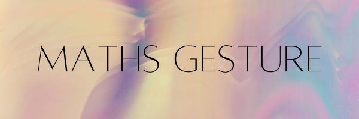

# ✋ Math Gesture Solver



A real-time, gesture-controlled application that allows you to draw mathematical problems in the air with your hand and get instant solutions from Google's Gemini AI. Built with Streamlit, OpenCV, and MediaPipe.

---

## ✨ Features

* **🎥 Live Camera Feed:** Uses your webcam to capture video in real-time.
* **✍️ Gesture Drawing:** Draw numbers and mathematical symbols by raising your index finger.
* **🧠 AI-Powered Solutions:** Utilizes the Google Gemini API to interpret the drawn problem and provide a step-by-step solution.
* **🎮 Intuitive Controls:**
    * ☝️ **Draw:** Raise your index finger to write.
    * 👍 **Clear:** Give a thumbs-up to erase the canvas.
    * 🖐️ **Solve:** Show an open palm to submit the problem to the AI.
* **🌐 Web Interface:** Clean and simple user interface built with Streamlit.

---

## ⚙️ How It Works

1.  **Camera Input:** The application captures video from your webcam using **OpenCV**.
2.  **Hand Tracking:** **MediaPipe**'s Hands solution detects and tracks the landmarks of your hand in the video feed.
3.  **Gesture Recognition:** The code analyzes the positions of your finger landmarks to recognize three key gestures: drawing (index finger up), clearing (thumb up), and solving (all fingers up).
4.  **Virtual Canvas:** When you make the "draw" gesture, the path of your index fingertip is drawn onto a virtual canvas (a NumPy array).
5.  **AI Integration:** When the "solve" gesture is detected, the image of the canvas is sent to the **Google Gemini** model.
6.  **Display Output:** The AI's response is streamed back and displayed in the Streamlit web interface.

---

## 🛠️ Technologies Used

* **Python**
* **Streamlit:** For the web application framework.
* **OpenCV:** For camera access and image processing.
* **MediaPipe:** For real-time hand tracking.
* **Google Generative AI:** For the AI-powered math solving (Gemini API).
* **Pillow (PIL):** For image manipulation.
* **NumPy:** For numerical operations and creating the canvas.

---

## 🚀 Getting Started

Follow these instructions to get the project running on your local machine.

### Prerequisites

* Python 3.8+
* A webcam

### 1. Clone the Repository

```bash
git clone [https://github.com/your-username/math-gesture-solver.git](https://github.com/your-username/math-gesture-solver.git)
cd math-gesture-solver
```
### 2. Create a Virtual Environment
It's recommended to create a virtual environment to manage dependencies.

```bash
# For Windows
python -m venv venv
venv\Scripts\activate

# For macOS/Linux
python3 -m venv venv
source venv/bin/activate
```

### 3. Install Dependencies
Create a requirements.txt file with the following content:

requirements.txt
```bash
streamlit
opencv-python
numpy
Pillow
google-generativeai
mediapipe
```

Then, install the packages:
```bash
pip install -r requirements.txt
```

### 4. Set Up API Key
This project uses the Gemini API, which requires an API key.

Get your API key from Google AI Studio.

Create a folder named .streamlit in the root of your project directory.

Inside the .streamlit folder, create a file named secrets.toml.

Add your API key to the secrets.toml file like this:
```bash
GEMINI_API_KEY = "YOUR_API_KEY_HERE"
```

### 5. Run the Application
Execute the following command in your terminal:
```bash
streamlit run app.py
```

## 🕹️ How to Use
Start the App: Once the app is running, allow browser access to your webcam.

Draw (☝️): Raise only your index finger. Move your finger in front of the camera to draw your math problem on the screen.

Clear (👍): Make a thumbs-up gesture to completely clear the drawing canvas.

Solve (🖐️): Open your hand to show all five fingers. This will send the drawing to the AI, and the solution will appear in the "AI Answer" box.
